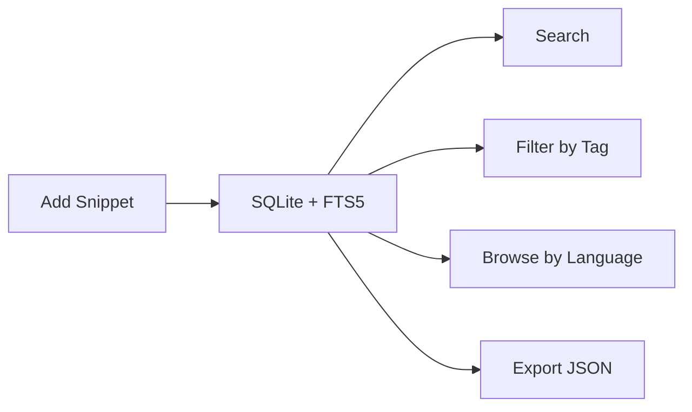

# CodeLoom

[](https://github.com/MukundaKatta/CodeLoom/actions/workflows/ci.yml)
[](https://www.python.org/)
[](LICENSE)

> **Store, search, tag, and organize your code snippets — powered by SQLite and FTS5.**



## Features

- **SQLite-backed** — zero external dependencies, works offline
- **Full-text search** — find snippets by title, description, code, or tags
- **Tag-based filtering** — organize with flexible tagging
- **Language detection** — auto-detects 12+ languages from code content
- **Import/Export** — JSON-based portability
- **Statistics** — counts by language, by tag, most recent snippets
- **CLI-first** — fast terminal workflow via `codeloom` command

## Quickstart

```bash
# Install
pip install -e ".[dev]"

# Add a snippet
codeloom add -t "Quick Sort" -l python -c "def qsort(arr): ..." --tags "algo,sorting"

# Search
codeloom search "sort"

# List all
codeloom list

# Show details
codeloom show 1

# Filter by tag
codeloom search "algo"

# View stats
codeloom stats

# Export
codeloom export snippets.json
```

## Python API

```python
from codeloom import SnippetStore, Snippet

store = SnippetStore("my_snippets.db")

# Add
snippet = store.add(Snippet(
    title="Fibonacci",
    code="def fib(n): return n if n < 2 else fib(n-1) + fib(n-2)",
    tags=["math", "recursion"],
))

# Search
results = store.search("fibonacci")

# Stats
print(store.stats_by_language())
print(store.stats_by_tag())
```

## Project Structure

```
src/codeloom/
  __init__.py      Package exports
  core.py          Snippet + SnippetStore (CRUD, search, stats)
  config.py        DB path & configuration
  utils.py         CLI formatting utilities
  __main__.py      CLI entry point
tests/
  test_core.py     Comprehensive test suite
```

## Development

```bash
make install    # Install in editable mode
make test       # Run tests
make lint       # Lint with ruff
make format     # Auto-format
```

## License

MIT — see [LICENSE](LICENSE).

---

Built by **Officethree Technologies** | Made with ❤️ and AI
