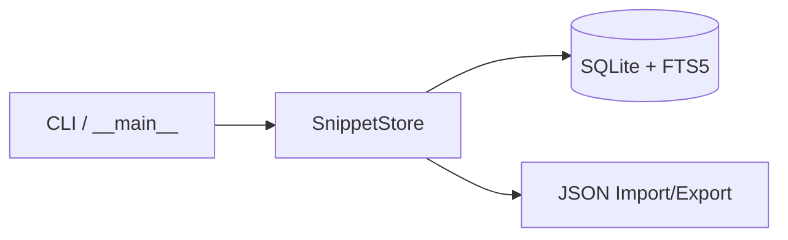

# Architecture

## Overview

CodeLoom is a local-first code snippet manager backed by SQLite with FTS5 full-text search.

```
src/codeloom/
  __init__.py      Package entry & public API
  core.py          Snippet dataclass + SnippetStore (SQLite CRUD, search, stats)
  config.py        Database path resolution & configuration
  utils.py         CLI formatting helpers
  __main__.py      Argument parsing & CLI commands
```

## Data Flow



## Storage

- **SQLite** with a `snippets` table and `snippets_fts` FTS5 virtual table.
- Triggers keep the FTS index in sync on INSERT, UPDATE, and DELETE.
- Default location: `~/.codeloom/snippets.db` (override via `CODELOOM_DB_PATH`).

## Language Detection

A simple keyword-heuristic scorer checks code content against known patterns for 12+ languages and picks the highest-scoring match. Falls back to `"text"` when nothing matches.

## Design Decisions

| Decision | Rationale |
|---|---|
| SQLite | Zero-dependency, local-first, portable |
| FTS5 | Fast full-text search without external services |
| Dataclass | Simple, typed, serializable |
| No ORM | Minimal footprint, direct SQL for clarity |
